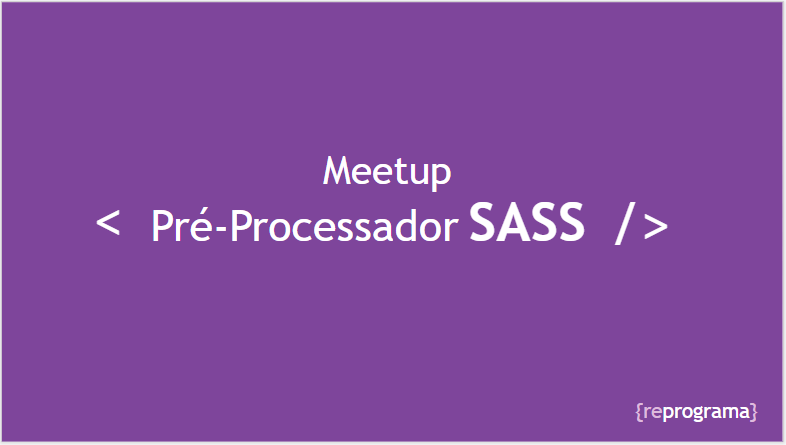

# Meetup Reprograma
## Introdução ao SASS
Esse repositório, é parte do material complementar ao Meetup Online  da {Reprograma} que acontece no dia 29/10/2019. Onde abordamos uma uma pequena introdução ao SASS (conceitos básico, instalação e execução para aplicação em uma página web). 

#  Iniciando o "Projeto-Prático"

Essas instruções farão com que você tenha uma cópia do projeto em execução na sua máquina local para fins de desenvolvimento e teste.

## Para a instalação

Para a execução do projeto em sua máquina, deverá conter as seguintes dependências instaladas a partir das versões:

   

## Instalando 

Para instalar as dependências do projeto, execute os seguintes comandos no terminal:

    npm install

Para transpilação(compilação) o arquivo style.scss para style.css, execute o comando:

    npm run compile

Para monitorar a transpilação(compilação) do arquivo style.css execute:

    npm run watch

Execute o arquivo abaixo para inicialização do projeto:

    index.html

# Tudo sobre o SASS

## Link de acesso ao slide do meetup

[Introdução ao SASS](https://docs.google.com/presentation/d/e/https://docs.google.com/presentation/d/e/2PACX-1vRPvqtCK8JKuaunxc2L7aMITGjroh0YJTQFjOzfl6ho6lICVleU8p7FqKQKs1TjdQ5DFBRpoBG-eb-d/pub?start=false&loop=false&delayms=3000 "Clique e acesse agora!")

## Instalado o SASS

 Para instalação do SASS em um ambiente, Windows ou Linux, siga as instruções abaixo: 

Para instalação global:

    npm install -g sass

ou

Instalação pelo gerenciador de pacotes "Chocolatey":

    choco install sass

**Para instação  no Mac**

Instalação pelo gerenciador de pacotes "Homebrew":

    brew install sass/sass/sass

## Executando o SASS

O navegador não renderiza o sass nativamente, para que isso ocorra é necesssario a criação de um arquivo css.

Seguindo o seguinte comando:

    sass --watch style.scss:style.css

# Links para se aprofundar

Documentação do SASS - "Obs: **documentação em inglês"**:

[Sass-documentation](https://sass-lang.com "Clique e acesse agora!")

Gerenciador de pacotes **Chocolatey**:

[chocolatey.org](https://chocolatey.org/ "Clique e acesse agora!")

Gerenciador de pacotes **Homebrew**:

[homebrew](https://brew.sh "Clique e acesse agora!")

## Textos sobre:

Texto Medium:

[SASS - Por onde começar ?](https://brew.sh "Clique e acesse agora!")

[O que é SASS. E porque você deveria começar a utilizá-lo.](https://medium.com/@thejasonfile/getting-started-with-sass-dedb271bdf5a "Clique e acesse agora!")

[Um guia para iniciantes](https://www.igluonline.com/introducao-ao-sass-um-guia-para-iniciantes/ "Clique e acesse agora!")

[Getting Started with Sass](https://medium.com/@ksykes/getting-started-with-sass-48cedde031c0 "Clique e acesse agora!")
